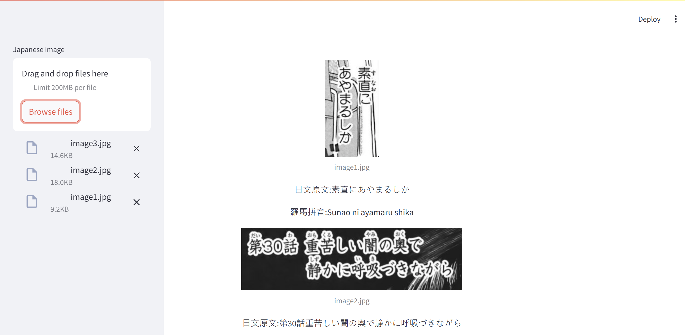

# Demonstration

As the above the demonstration image, you could tell from the side bar, you could upload image which would then be shown in the right area with the text as well as romaji displayed.

# Components

- **Streamlit**: The application is realised as an web application via Streamlit, providing an simple, neat, tidy interface for users
- **Hugging face**: "kha-white/manga-ocr-base" is used for OCR which captures the japanese from the image.

# Extre Details

The projects mainly serve as a helper in case that you would need the Japanese but you cannot copy and paste. 

**manga-ocr-base** is used mainly due to its excellent performance that could extract image of different size and quality.

Originally, a translation model would be supplied. However, due to unsatisfactory performance of different models, it is not integrated.

Perhaps a better translation model would be LLM rather than translation model.

# Realization Process

- Manga ocr to extract the text
- Streanlit for upload image and display images and contents
- Cutlet for romaji translation

# Notice
The Romaji translation may not be idea but definitely wonderful in most of the time

OCR performs great but occasionally makes mistakes.
